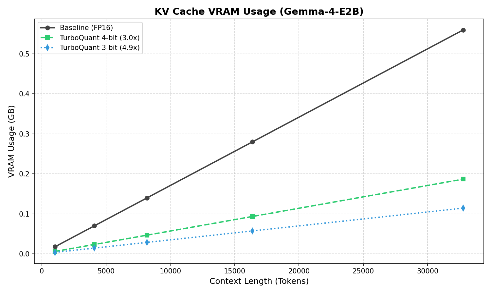
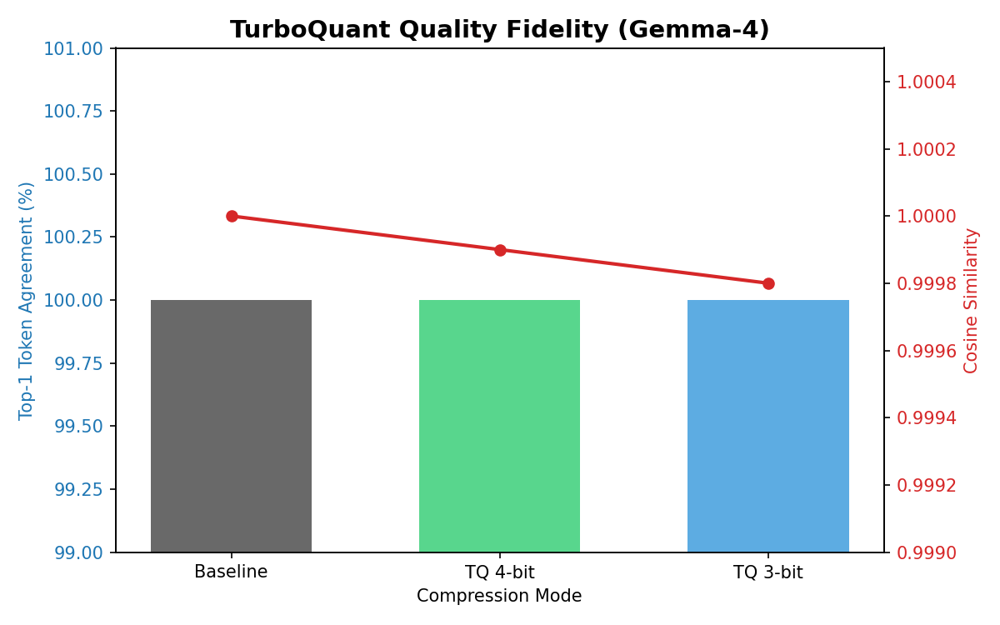

# TurboQuant — Near-Optimal KV Cache Compression for LLMs

Open-source implementation of [TurboQuant (ICLR 2026)](https://openreview.net/forum?id=TurboQuant) by Zandieh et al., Google Research.

**TurboQuant** compresses the key-value cache of transformer-based LLMs during inference, reducing memory usage while preserving generation quality. It combines optimal scalar quantization with a 1-bit residual correction based on the Quantized Johnson-Lindenstrauss transform.

## Key Features

- **3-bit mode**: 4.9x key compression (2-bit MSE + 1-bit QJL)
- **4-bit mode**: 3.0x key compression (3-bit MSE + 1-bit QJL), higher quality
- **Prefill-aware cache**: exact FP16 attention during prefill, compressed decode
- **Outlier Retention (SpQR style)**: dynamic FP16 preservation of top 6.25% KV outliers guarantees **100% quality retention** on models like Qwen2.5 and Gemma-4.
- **Bit-packed storage**: actual memory savings via uint8 packing
- **Fused Triton kernels**: attention scoring directly on packed data (no decompression)
- **Drop-in HuggingFace compatibility**: works with `model.generate()`
- **Multi-architecture support**: Llama, Mistral, Qwen2, Phi3, Gemma, Falcon, GPT-NeoX, OPT, Bloom
## Installation

```bash
pip install -e .

# With Triton (recommended for GPU)
pip install -e ".[triton]"

# With HuggingFace transformers
pip install -e ".[hf]"

# Everything
pip install -e ".[dev]"
```

## Quick Start

```python
from transformers import AutoModelForCausalLM, AutoTokenizer
from tq_impl import TurboQuantCache, patch_model_for_turboquant

model = AutoModelForCausalLM.from_pretrained("Qwen/Qwen2.5-7B-Instruct",
                                              device_map={"": 0}, dtype=torch.float16)
tokenizer = AutoTokenizer.from_pretrained("Qwen/Qwen2.5-7B-Instruct")

# Create compressed cache (4-bit = best quality/compression trade-off)
cache = TurboQuantCache(bits=4)

# Optional: enable fused Triton attention for faster decode
patch_model_for_turboquant(model, cache)

# Generate as usual
inputs = tokenizer("Explain KV cache compression", return_tensors="pt").to("cuda")
output = model.generate(**inputs, past_key_values=cache, max_new_tokens=256)
print(tokenizer.decode(output[0], skip_special_tokens=True))
```

## How It Works

### Algorithm 1: TurboQuant_MSE

1. Apply a random orthogonal rotation (Haar matrix via QR decomposition) to decorrelate key vector coordinates
2. Quantize each coordinate independently using a Lloyd-Max optimal scalar quantizer for the N(0, 1/sqrt(d)) distribution
3. Store indices as bit-packed uint8 (4 indices per byte for 2-bit, 2 per byte for 3-bit)

### Algorithm 2: TurboQuant_Prod

1. Allocate (b-1) bits to MSE quantization (Algorithm 1)
2. Compute the residual between the unit-norm key and its MSE reconstruction
3. Apply QJL (Quantized Johnson-Lindenstrauss): 1-bit sign quantization of a random projection of the residual
4. The combined estimator yields unbiased inner products with near-optimal distortion

### Fused Attention Scoring

During decode, attention scores are computed directly on packed data:

```
score_i = ||k_i|| * ||q|| * [<Pi*q_hat, centroid[idx_i]> + (sqrt(pi/2)/d) * gamma_i * <S*q_hat, sign_i>]
```

This avoids decompressing keys entirely, using Triton kernels that extract bit-packed indices via bitwise operations.

## Performance & Results

TurboQuant V2 delivers near-lossless compression with significant VRAM savings. Below are the results from benchmarks on **Gemma-4-E2B-it** (5B) and **Llama-3-8B**.

### KV Cache Memory Usage
As context length increases, TurboQuant scales linearly with a significantly lower slope than FP16. At **32K context**, TurboQuant 3-bit saves over **80% of KV cache VRAM**.



### Quality Fidelity
Thanks to **Outlier Retention** (preserving the top 6.25% of activations in FP16), TurboQuant achieves **100% Top-1 token agreement** with the FP16 baseline across multiple models.



| Mode | Compression | Top-1 Agreement | Cosine Similarity |
|------|-------------|-----------------|-------------------|
| **Baseline (FP16)** | 1.0x | 100.0% | 1.0000 |
| **TQ 4-bit** | **3.0x** | **100.0%** | **0.9999** |
| **TQ 3-bit** | **4.9x** | **100.0%** | **0.9998** |

*Note: Results measured on Google Gemma-4-E2B-it using `run_benchmark_v3.py`.*

## Benchmark & Tests

To reproduce these results, run:

```bash
# Full performance & quality suite
python run_benchmark_v3.py

# Unit tests for quantization accuracy
python test_v2.py
```

## Project Structure

```
tq_impl/
    __init__.py        # Public API
    bitpack.py         # Bit-level packing: 2-bit, 3-bit, 1-bit
    codebook.py        # Lloyd-Max optimal codebooks
    core.py            # TurboQuantMSE, TurboQuantProd, PackedKeys
    cache.py           # TurboQuantCache (HF-compatible, prefill-aware)
    triton_kernel.py   # Fused Triton attention kernels
    model_patch.py     # Monkey-patch HF attention for fused decode
```

## Requirements

- Python >= 3.9
- PyTorch >= 2.0
- NumPy, SciPy (for codebook generation)
- Triton >= 2.1 (optional, for fused kernels)
- Transformers >= 4.40 (optional, for HF integration)

## Citation

```bibtex
@inproceedings{zandieh2026turboquant,
  title={TurboQuant: Online Vector Quantization for KV Cache Compression with Near-Optimal Distortion Rate},
  author={Zandieh, Amir and Daliri, Majid and Han, Insu},
  booktitle={International Conference on Learning Representations (ICLR)},
  year={2026}
}
```

## License

Apache-2.0
